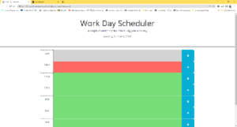

# Work Day Scheduler

## technologies Used

| Technology Used         | Resource URL           | 
| ------------- |:-------------:| 
| Javascript    | [https://developer.mozilla.org/en-US/docs/Web/JavaScript](https://developer.mozilla.org/en-US/docs/Web/JavaScript) | 
| HTML    | [https://developer.mozilla.org/en-US/docs/Web/HTML](https://developer.mozilla.org/en-US/docs/Web/HTML) | 
| Bootstrap    | [https://getbootstrap.com/docs/5.0/getting-started/introduction/](https://getbootstrap.com/docs/5.0/getting-started/introduction/)      |   
| JQuery | [https://jquery.com/](https://jquery.com/)     |  
| Day.js | [https://day.js.org/](https://day.js.org/)     |  

## Description

[Visit the deployed site here](placeholder)

## Usage

## Learning Points

## Arthor Info

[Github](https://github.com/BrettSantor)

[LinkdIn](https://www.linkedin.com/in/brett-santor-a098b923b/)

[Portfolio](https://brettsantor.github.io/Santor-Services/)

You can find out more about me and my work by following these links!

## Credit

All this coding made possible by [Jerome Chenette](https://github.com/jeromechenette) and my fellow students who help each other along the way
